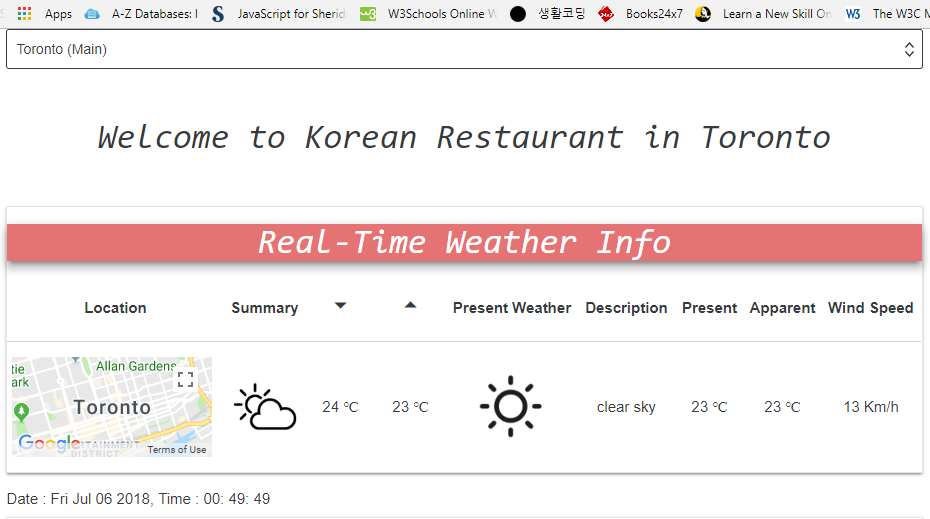
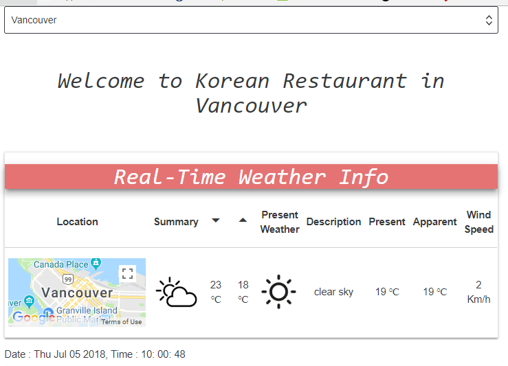

# Real-Time Menu Recommendation Order Based on Weather Change built by React, Node, and MongoDB

## Front : React (ReduxForm, GoogleMAP, DarkSky, OpenWeather and etc.)
## Back : Node (Express, Mocha, and etc.)

## Main Concept :
#### Weather is one of the most powerful element that impacts on a menu choice in a restaurant. As enclosing this real-time weather information, the applicat makes customers intuitively choose and order their favorit foods in a bit.

## App Structure :
#### Restaurant Branches, Real-Time Weather based on Locations, Recommendation Menus based on preset weather info, Food Details, Menu Order,  Guesbooks(containing Customer's Food Evaluation and Recommendation), Guestbook Management, and Login & Logout

## [Main Page : Restaurant Location, Real-Time Weather Info, Menu Recommendation, Food Details, and Menu Order]
## Restaurant Location an Real-Time Weather Info
## Toronto Restaurant
## 
## Vancouver Restaurant
## 
