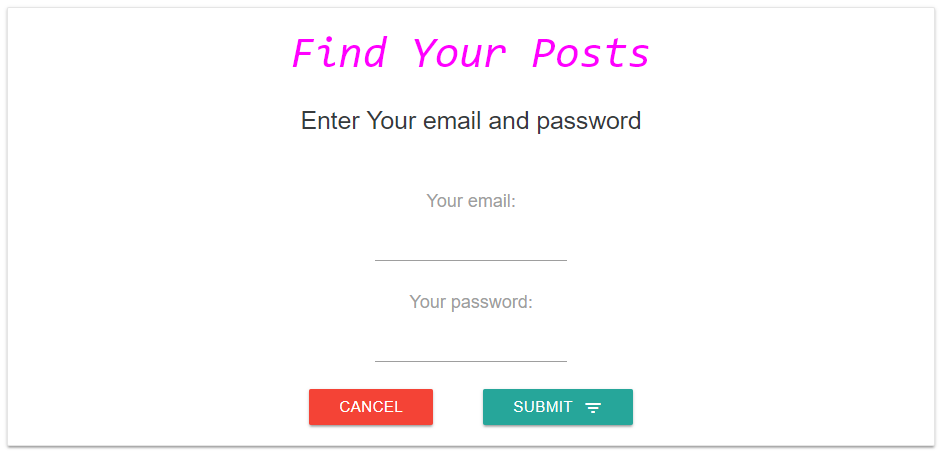

# Real-Time Menu Recommendation Order Based on Weather Change built by React, Node, and MongoDB

## Front : React (ReduxForm, GoogleMAP, DarkSky, OpenWeather and etc.)
## Back : Node (Express, Mocha, and etc.)

## Main Concept :
#### Weather is one of the most powerful element that impacts on a menu choice in a restaurant. As enclosing this real-time weather information, the applicat makes customers intuitively choose and order their favorit foods in a bit.

## App Structure :
#### Restaurant Branches
#### Real-Time Weather based on Locations
#### Recommendation Menus based on preset weather info
#### Food Details, Menu Order, Guesbooks(containing Customer's Food Evaluation and Recommendation)
#### Guestbook Management
#### Login & Logout

### 1. Main Page : Restaurant Location, Real-Time Weather Info, Menu Recommendation, Food Details, and Menu Order
#### 1.1 Restaurant Location and Weather Information
####      - displaying Local weather information 
####      - updating weather information every 5 minutes 
####      - and utilizing OpenWeatherMap, DarkSky, and GoogleMap modules
##### [Toronto Restaurant]
##### 
##### [Vancouver Restaurant]
##### 
#### 1.2 Recommendatiion Menus  
####      - implementing weather information in the background
####      - updating new recommendation menus every 5 minutes
####      - and using a customized recommendation engine
##### 
#### 1.3 Menu & Order  
####      - rendering checkbox button, "+" in circles for customers to choose menus
####      - dipalying simple and intuitive buttons for customers to finalize a number of orders
####      - linking to food description pages which also show the customers the previous customer's recommendations
##### 
##### 1.3.1 Menu Description
#####     - containing detail menu information to help customers choose select their menu
#####     - showing previous customer's recommendation to help the present customers easily understand the foolds
######       . FYI, the negative opinions from the previous customers do not show up. 
######       . Also, the number of recommendations are limited to 4 in this description page
######          because it can prevent the customer from finding another menus rendered down below
##### 
##### 1.3.2 Menu Description
#####     - displaying estimated billing information 
#####     - and including functions to cancel their choices and to submit their orders to be finalized
#####     - FYI, Modal is imported to display bill information
##### 
#### 1.4 Customer Survey  
####      - generating a form that the customers can enter their opions about foods and services
####      - enclosing form validation 
####      - automatically generating the present customer's choices
####      - and providing email and password inputs that are required for the customers to login and then delete their posts
####      - FYI, bcrypt, mongoose, mlab are implemented in node
##### 
##### 1.4.1 Posting Board
#####     - listing up all posts all the customers uploaded 
#####     - hiding the "dislike" posts for the marketing reason
#####     - and limiting to 10 posts to save time (The customers are able to view whole food information at "menu description", instead.)
#####     - FYI, it works with mlab to pull out data out of database 
##### 
##### 1.4.2 Post
#####     - displaying the previous customer's posts 
#####     - and hiding "Delete" button without login
##### 
##### 1.4.3 Login
#####     - rendering a form that the customers enter email and password to delete their posts 
#####     - and functioning validation about email and password
##### 
##### 1.4.4 Individual Customer's Posting Board
#####     - rendering a form that the customers enter email and password to delete their posts 
#####     - and functioning validation about email and password
##### 

