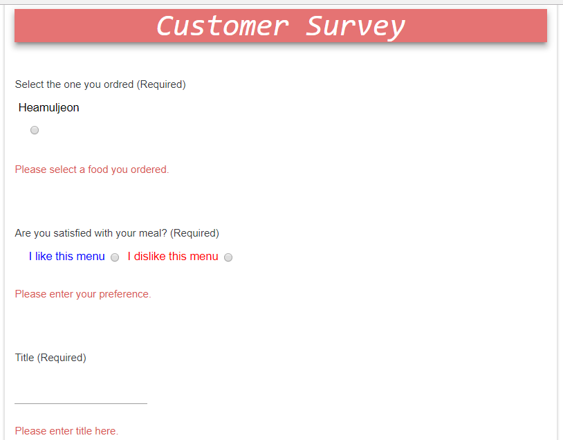
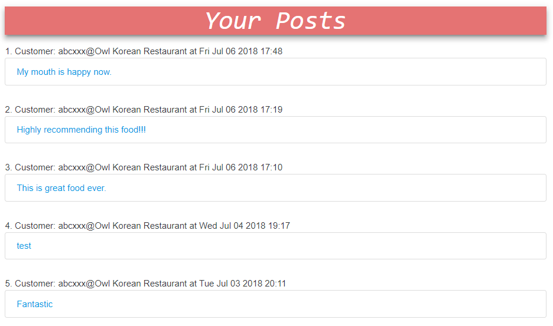

# Real-Time Menu Recommendation and Order Application Based on Weather Change built by React, Node, and MongoDB

## Front : React (Redux, Redux Form to wire up GoogleMAP, DarkSky and OpenWeather API data)
## Back : Node (Express and Mocha)

## Application Concept :
#### Weather always impacts on a menu choice in a restaurant. As enclosing this real-time weather information, the application helps customers intuitively choose and order their favorit foods in a bit.

## App Structure :
#### Restaurant Locations
#### Real-Time Weather based on Locations
#### Recommendation Menus based on Preset weather Information
#### Menu Order including Detail Menu Descripton 
#### Guesbooks(containing Customer's Food Evaluation and Recommendation)
#### Login & Logout

#### 1. Restaurant Location and Weather Information
####      - displaying local weather information 
####      - updating weather information every 5 minutes 
####      - and utilizing OpenWeatherMap, DarkSky, and GoogleMap modules
##### [Toronto Restaurant]
##### 
##### [Vancouver Restaurant]
##### 
#### 2. Recommendatiion Menus  
####      - implementing weather information in the background
####      - updating new recommendation menus every 5 minutes
####      - and plugging a customized recommendation engine in
##### 
#### 3. Menu & Order  
####      - rendering checkbox button, "+", in a circle for customers to choose menus
####      - dipalying simple and intuitive buttons for the customers to finalize a number of orders
####      - linking to food description pages which also show the customers the previous customer's review and recommendations
##### 
##### 3.1 Menu Description
#####     - containing detail menu information to help customers choose their best menu
#####     - showing previous customer's recommendations to help the present customers easily understand different foods
#####       . FYI, the negative posts from the previous customers do not pop up. 
#####       . Also, the number of recommendations are limited to 4 in this description page
#####          because it gets the customer to spend a lot of time
##### 
##### 3.2 Menu Description
#####     - displaying estimated billing information 
#####     - and including a function to cancel their choices or to submit their orders
#####     - FYI, Modal is imported to display bill information
##### 
#### 4. Customer Survey  
####      - generating a form where the customers can enter their posts about foods and services
####      - enclosing form validation
####      - automatically generating the foods the customers just ordered
####      - and providing email and password inputs that are required for the customers to login and then delete their posts
####      - FYI, bcrypt, mongoose, mlab are implemented in node
##### 
##### 4.1 Posting Board
#####     - listing the posts all the customers uploaded 
#####     - hiding the "dislike"ed posts for the marketing reason
#####     - and limiting a number of posts to 10 to save time (The customers are able to view whole posts at "menu description", instead.)
#####     - FYI, it works with mlab 
##### 
##### 4.2 Post
#####     - displaying the previous customer's posts 
#####     - and hiding "Delete" button without login
##### 
##### 5. Login
#####     - rendering a form where the customers enter email and password to delete their posts 
#####     - and functioning validation about email and password
##### 
##### 5.1 Individual Customer's Posting Board
#####     - displaying individual customer's posts as they logged in
#####     - FYI, all data are pulled out of mlab through node
##### 
##### 5.2 Customer Post
#####     - displaying a "Delete" button only when the customer logged in 
##### 

